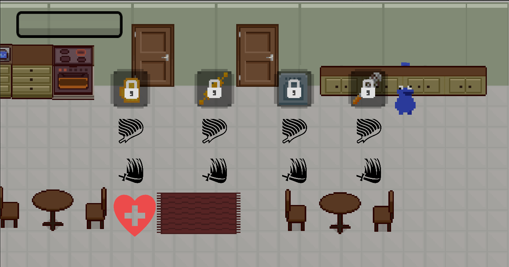
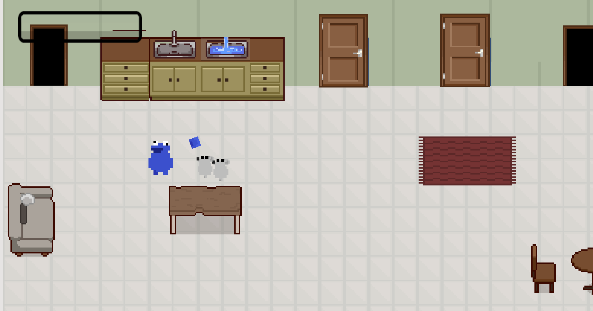

# Cookie Monster's Dream

A Roguelite, top-down, 2d pixel art game made for the Brackeys GameJam 2025

You play as the biscuit monster in his dream, going after all the biscuits, defeating everyone that stands in front of him with superhuman powers and a lots of hunger. Don't stand in his way!

  
*The in-game shop where players can buy upgrades.*

  
*A sample combat level showcasing enemies and attacks.*

## Controls

WASD - Move

Mouse - Look At

Space - Dash

M1 - Melee Attack

M2 - Ranged Attack

1 - Change Melee Weapon

2 - Change Ranged Weapon

### Team
Tiago Fernandes (https://github.com/tiagofernandes27) - Artist

Diogo Silva (https://github.com/DiogoV10) - Programmer

Lourenço Mayol (https://github.com/lourencoMayol) - Programmer